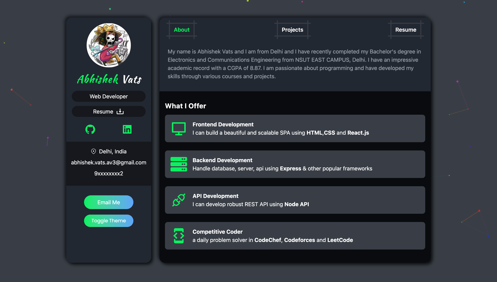

# 🚀 Abhishek Vats Portfolio



> Personal portfolio site built with React, TypeScript, Tailwind CSS, Framer Motion, and Redux. Showcasing my skills, projects, and experience in web development.

---

## 🌟 Features

- **About Me**: Quick intro and background
- **Resume**: Education, experience, and skills
- **Projects**: Interactive cards for my top projects
- **Sidebar & Navbar**: Smooth navigation
- **Theme Support**: Light/Dark mode
- **Animations**: Framer Motion for smooth transitions

---

## 🛠️ Tech Stack

- React
- TypeScript
- Tailwind CSS
- Framer Motion
- Redux
- Vite

---

## 📂 Projects

| Project                | Description                            | Demo                                                    | Code                                                               |
| ---------------------- | -------------------------------------- | ------------------------------------------------------- | ------------------------------------------------------------------ |
| Problem Tracker        | Track DSA problems, visualize progress | [Live](https://problemtracker.netlify.app/login)        | [Repo](https://github.com/abhishekvatsAV/problem-tracker-frontend) |
| Chat App               | Real-time messaging with group chat    | [Live](https://chit-talks-app.netlify.app/)             | [Repo](https://github.com/abhishekvatsAV/Chit_Chat_App_Frontend)   |
| Memory Game            | Card-flipping game to match pairs      | [Live](https://memory-game-6fss.onrender.com/)          | [Repo](https://github.com/abhishekvatsAV/Memory_Game)              |
| Calculator             | Simple calculator with clean UI        | [Live](https://calculator-wljw.onrender.com/)           | [Repo](https://github.com/abhishekvatsAV/calculator)               |
| Random Quote Generator | Generate and share random quotes       | [Live](https://random-quote-machine-shc3.onrender.com/) | [Repo](https://github.com/abhishekvatsAV/Random_Quote_Machine)     |
| Portfolio              | This site!                             | [Live](https://abhishekvats.tech/)                      | [Repo](https://github.com/abhishekvatsAV/Portfolio)                |

---

## 📦 Setup & Development

```bash
# Install dependencies
pnpm install

# Start development server
pnpm run dev
```

---

## 📧 Contact

- [LinkedIn](https://www.linkedin.com/in/abhishek-vats-av/)
- [Email](abhishek.vats.av3@gmail.com)

> Made with ❤️ by Abhishek Vats
